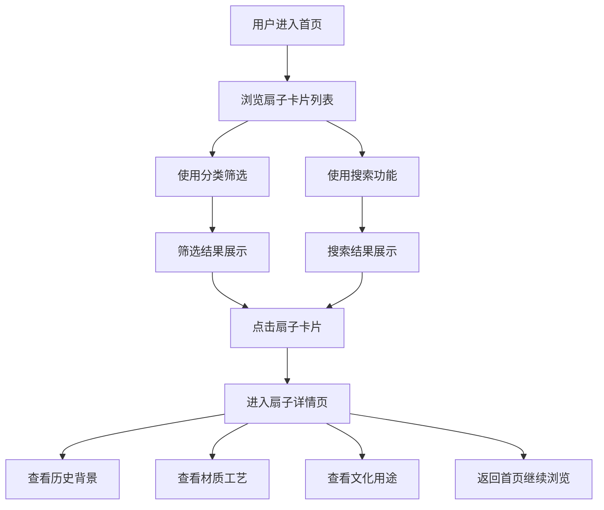

## 1. 产品概述

扇韵东方 —— 一个以中国传统扇子文化为主题的全栈 Web 展示平台，呈现团扇、折扇、羽扇等多种扇子类型，展现东方美学魅力。

- 主要目的：展示中国传统扇子文化，提供扇子浏览、搜索和详情查阅功能
- 目标用户：传统文化爱好者、设计师、学生、收藏家
- 产品价值：传承东方美学，让更多人了解扇子的历史背景、材质工艺和文化用途

## 2. 核心功能

### 2.1 用户角色

| 角色 | 注册方式 | 核心权限 |
|------|----------|----------|
| 游客用户 | 无需注册 | 浏览扇子列表、搜索扇子、查看扇子详情 |

### 2.2 功能模块

1. **首页**：导航栏、英雄区域、扇子分类筛选、扇子卡片列表、搜索功能
2. **扇子详情页**：扇子大图、基本信息、历史背景、材质工艺、文化用途、相关推荐

### 2.3 页面详情

| 页面名称 | 模块名称 | 功能描述 |
|----------|----------|----------|
| 首页 | 导航栏 | Logo、分类导航、搜索框入口、滚动时背景渐变 |
| 首页 | 英雄区域 | 大幅东方美学视觉、主题标语、装饰元素、入场动画 |
| 首页 | 分类筛选 | 团扇/折扇/羽扇/全部 分类标签切换 |
| 首页 | 扇子卡片列表 | 图片、名称、类型标签、简短描述、悬停动效 |
| 首页 | 搜索功能 | 实时搜索扇子名称和描述、搜索动画 |
| 详情页 | 扇子展示区 | 大图展示、名称、类型、收藏按钮 |
| 详情页 | 信息标签区 | 材质、年代、产地等标签化展示 |
| 详情页 | 历史背景 | 扇子的历史起源与发展故事 |
| 详情页 | 材质工艺 | 制作材料和工艺介绍 |
| 详情页 | 文化用途 | 扇子在不同场合的文化意义 |
| 详情页 | 相关推荐 | 同类扇子推荐卡片 |

## 3. 核心流程

用户进入首页，浏览扇子卡片列表，可通过分类筛选或搜索框快速找到感兴趣的扇子，点击卡片进入详情页，了解扇子的历史背景、材质工艺和文化用途，可返回继续浏览其他扇子。

## 4. 用户界面设计

### 4.1 设计风格

- **主色调**：朱砂红 (#C8102E) —— 象征东方传统与典雅
- **辅助色**：墨玉黑 (#1A1A1A)、宣纸米 (#F5F0E8)、竹青 (#7D9B6A)
- **点缀色**：鎏金 (#C9A959) —— 用于强调和装饰
- **按钮风格**：圆角矩形、轻微阴影、悬停时微微上浮、朱砂红主按钮
- **字体**：标题使用「Noto Serif SC」宋体风格，正文使用「Noto Sans SC」
- **布局风格**：留白充足、卡片式布局、对称与不对称结合、东方韵味构图
- **装饰元素**：云纹、水墨笔触、折扇纹理、印章元素
- **图标风格**：线性简洁图标，搭配东方元素

### 4.2 页面设计概述

| 页面名称 | 模块名称 | UI 元素 |
|----------|----------|---------|
| 首页 | 导航栏 | 半透明磨砂效果、滚动时加深背景、Logo 书法字体 |
| 首页 | 英雄区域 | 大幅背景图（扇子特写）、渐变蒙版、主标题书法字体、副标题、装饰线条 |
| 首页 | 分类筛选 | 横向标签栏、选中态为朱砂红下划线、平滑过渡 |
| 首页 | 卡片列表 | 响应式网格、卡片圆角、图片覆盖层、悬停放大+阴影加深 |
| 首页 | 搜索框 | 简约线条框、聚焦时扩展动画、搜索图标 |
| 详情页 | 展示区 | 大图左侧布局、文字右侧竖排标题风格 |
| 详情页 | 内容区 | 章节标题带装饰线、段落首字下沉、图文混排 |
| 详情页 | 标签区 | 椭圆形标签、宣纸底色、鎏金色边框 |

### 4.3 响应式

- 桌面优先设计，适配移动端
- 卡片网格：桌面 3 列、平板 2 列、手机 1 列
- 导航栏在移动端转为汉堡菜单
- 详情页图文布局在移动端改为上下堆叠
- 触摸优化：增大点击区域，优化滑动体验

### 4.4 动效设计

- 页面入场：元素从上到下渐次显现，带轻微位移
- 卡片悬停：图片缓慢放大、阴影加深、上移 4px
- 分类切换：内容区渐隐渐现过渡
- 搜索框：聚焦时边框颜色渐变、宽度微扩展
- 滚动时：导航栏背景由透明渐变为实色
- 详情页图片：加载时由模糊到清晰渐变
