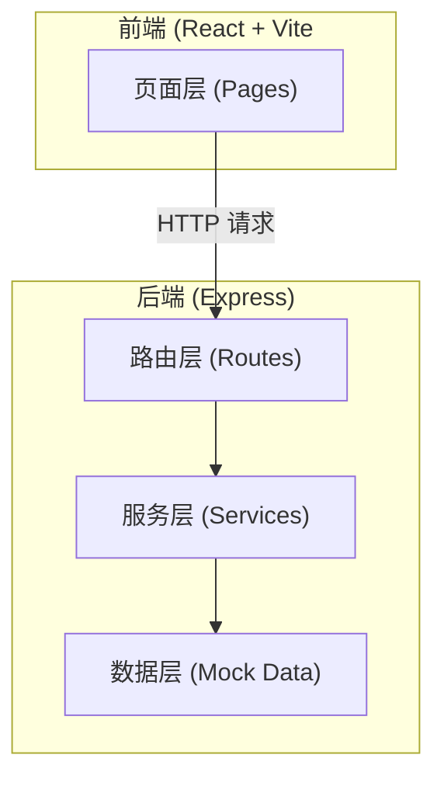
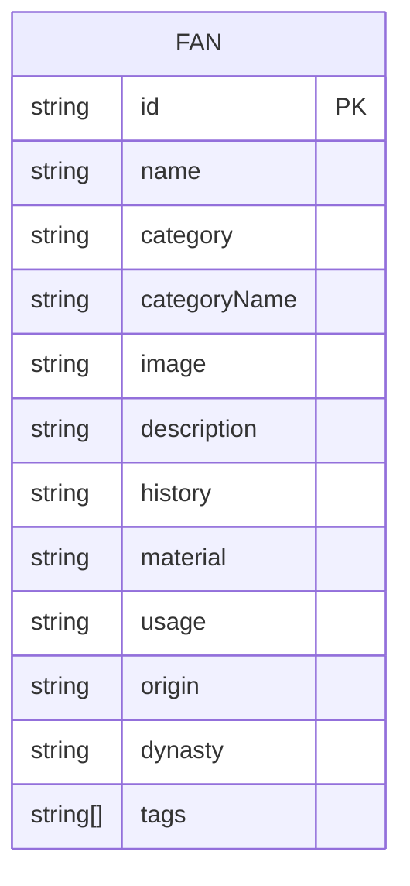

## 1. 架构设计



## 2. 技术描述

- **前端**：React 18 + TypeScript + Tailwind CSS 3 + React Router DOM + Zustand + Vite
- **初始化工具**：vite-init (react-express-ts 模板)
- **后端**：Express 4 + TypeScript
- **数据**：Mock 数据（内存存储，无需数据库，后续可扩展数据库）
- **状态管理**：Zustand
- **图标库**：Lucide React

## 3. 路由定义

### 前端路由

| 路由路径 | 页面名称 | 用途 |
|----------|----------|------|
| `/` | 首页 | 扇子列表展示、分类筛选、搜索功能 |
| `/fan/:id` | 扇子详情页 | 扇子详情信息展示 |

### 后端 API 路由

| 路由路径 | 方法 | 用途 |
|----------|------|------|
| `/api/fans` | GET | 获取扇子列表（支持分类筛选、搜索） |
| `/api/fans/:id` | GET | 获取扇子详情 |
| `/api/fans/categories` | GET | 获取扇子分类列表 |

## 4. API 定义

### 4.1 扇子数据类型

```typescript
interface Fan {
  id: string;
  name: string;
  category: 'round' | 'folding' | 'feather';
  categoryName: string;
  image: string;
  description: string;
  history: string;
  material: string;
  usage: string;
  origin: string;
  dynasty: string;
  tags: string[];
}
```

### 4.2 获取扇子列表

**请求**：`GET /api/fans?category=&keyword=

**请求参数**：
- `category` (可选): 分类类型
- `keyword` (可选): 搜索关键词

**响应**：
```typescript
{
  success: boolean;
  data: Fan[];
}
```

### 4.3 获取扇子详情

**请求**：`GET /api/fans/:id`

**响应**：
```typescript
{
  success: boolean;
  data: Fan;
}
```

### 4.4 获取分类列表

**请求**：`GET /api/fans/categories`

**响应**：
```typescript
{
  success: boolean;
  data: { value: string; label: string }[];
}
```

## 5. 服务器架构图


- **路由层**：定义 API 端点，处理请求参数
- **服务层**：业务逻辑处理，数据筛选与搜索
- **数据层**：Mock 数据存储

## 6. 数据模型

### 6.1 数据模型定义



### 6.2 数据说明

- **id**: 唯一标识符
- **name**: 扇子名称
- **category**: 分类类型 (round/folding/feather)
- **categoryName**: 分类显示名称
- **image**: 扇子图片 URL
- **description**: 简短描述
- **history**: 历史背景介绍
- **material**: 材质工艺介绍
- **usage**: 文化用途介绍
- **origin**: 产地
- **dynasty**: 起源朝代/年代
- **tags**: 标签数组

## 7. 项目结构

```
.
├── src/                      # 前端代码
│   ├── components/          # 公共组件
│   │   ├── Navbar.tsx       # 导航栏
│   │   ├── FanCard.tsx      # 扇子卡片
│   │   ├── SearchBar.tsx     # 搜索框
│   │   └── CategoryFilter.tsx # 分类筛选
│   ├── pages/               # 页面
│   │   ├── Home.tsx         # 首页
│   │   └── FanDetail.tsx    # 详情页
│   ├── store/               # 状态管理
│   │   └── useFanStore.ts    # 扇子相关状态
│   ├── services/            # API 接口
│   │   └── fanApi.ts         # 扇子 API
│   ├── types/               # 类型定义
│   │   └── fan.ts            # 扇子类型
│   ├── App.tsx               # 根组件
│   ├── main.tsx             # 入口文件
│   └── index.css            # 全局样式
├── api/                      # 后端代码
│   ├── routes/               # 路由
│   │   └── fanRoutes.ts     # 扇子路由
│   ├── services/            # 服务
│   │   └── fanService.ts   # 扇子服务
│   ├── data/                 # 数据
│   │   └── fans.ts          # Mock 数据
│   ├── types/               # 类型
│   │   └── fan.ts           # 扇子类型
│   └── index.ts             # 服务入口
├── shared/                  # 共享类型
│   └── types.ts             # 共享类型定义
├── vite.config.ts
├── tailwind.config.js
├── tsconfig.json
└── package.json
```
